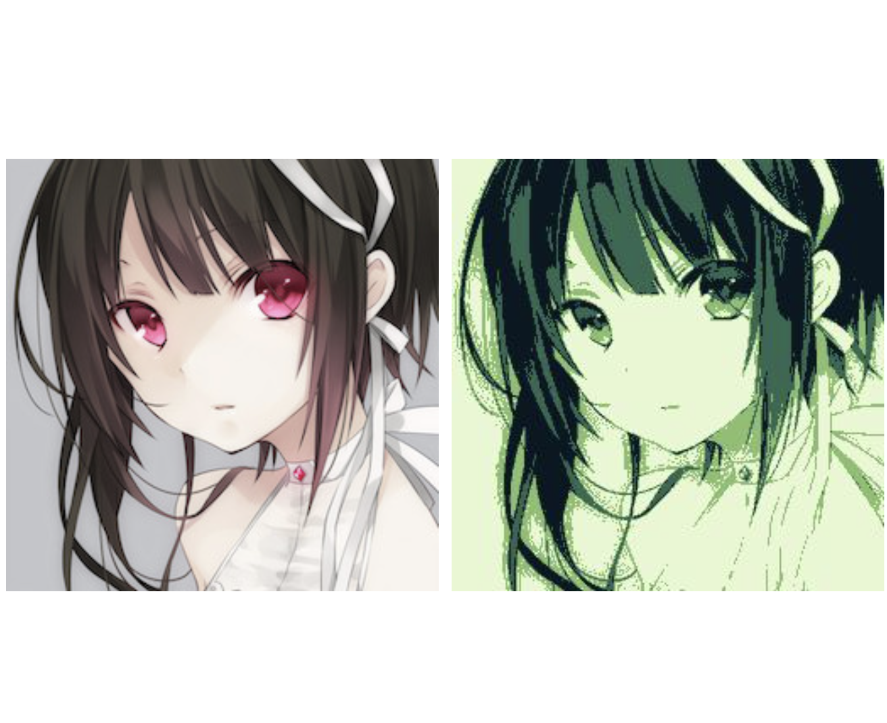

# ImageConverter

## 〜Summary〜
Pythonの画像処理の入門として作ったもの。   
入力した画像(PNG,JPG)を[GBstudio](https://www.gbstudio.dev/)で扱える4色の色に変換するアプリケーション。

## ~Usage~
.pyファイルを実行します。3つの質問に答えることで目的の画像を出力することができます。  

1. まず、グレースケールに変換を行ってからそれを元にして画像を4つの値に分けます。  
    5種類のグレースケール変換方法から選んで数字を入力してください。選べるのはＮＴＳＣ係数による加重平均法、   
    中間値法、単純平均化法、Gチャンネル法、ＨＤＴＶ係数による加重平均と補正法 の5種類です。   

2. 画像のパスをフルパスで入力してください。   
## 注意！！　警告にも出ますが、パスには拡張子を含めないでください！

3.  PNGかJPGファイルかを選択します。

4. ファイルが出力されます！。
